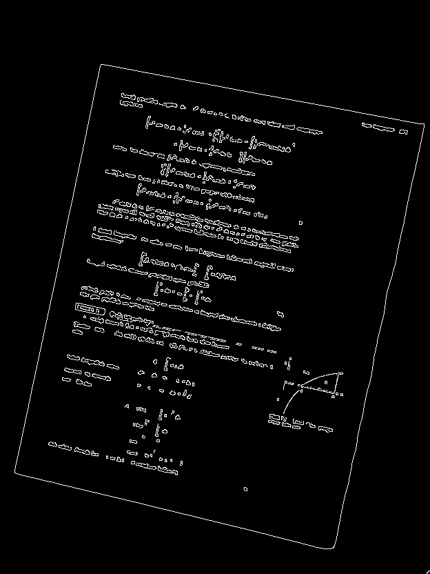
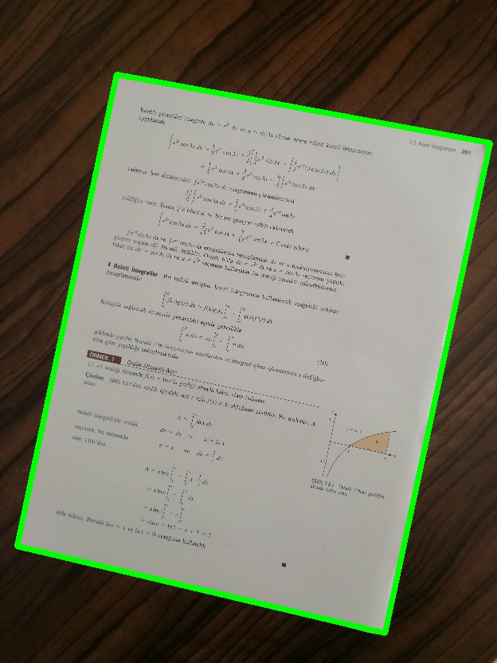
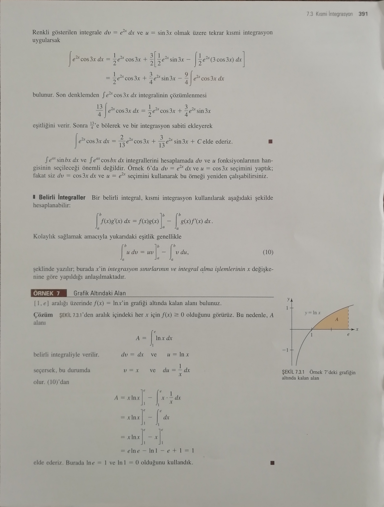
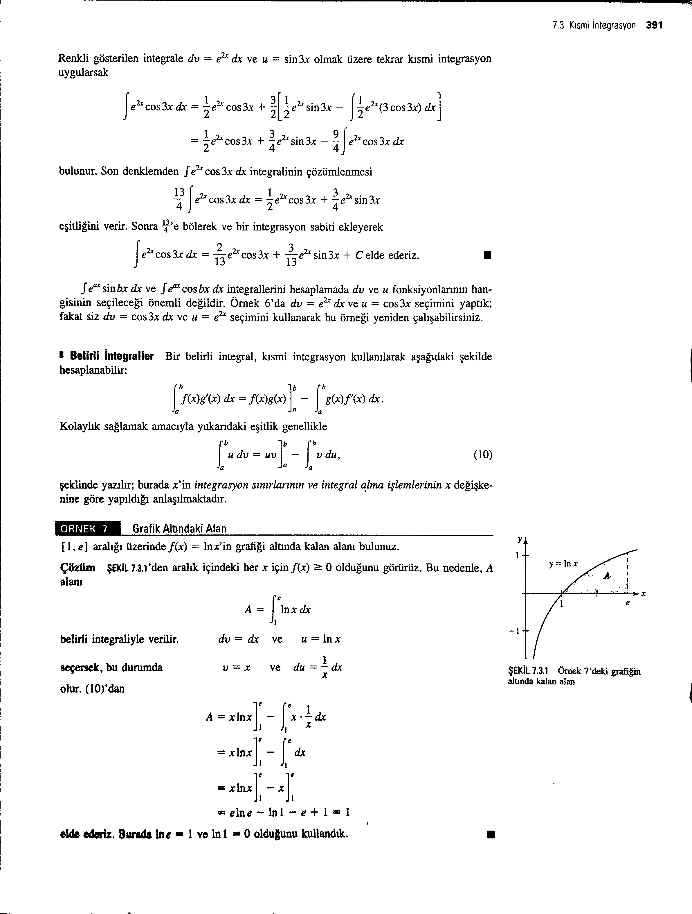

# Document Scanner by Black-White

## About
In this project;
The document image taken with the camera will be scanned and saved as a black and white cropped image.
Was used Python and library of OpenCV.

### Process for Document Area

,
  ,
    ,

### Converted to Black-White Image
,
